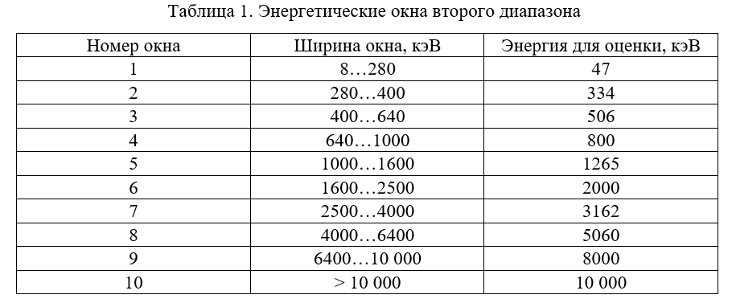
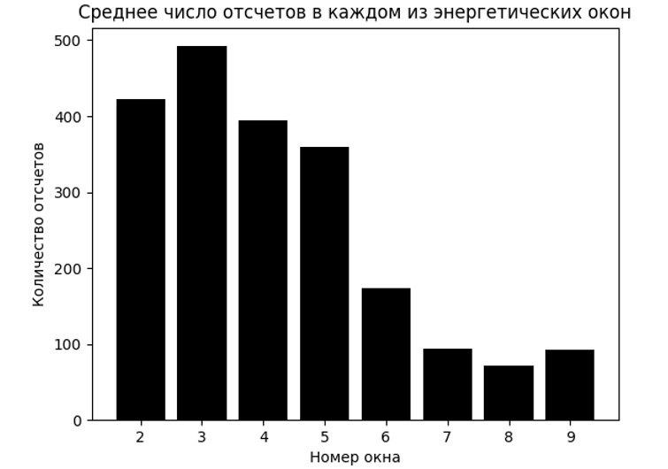

# Оценка интенсивности фонового излучения на орбите КА в экваториальной области

Программа, которая по данным временных историй за март 2009 года оценивает среднюю интенсивность излучения на орбите КА КОРОНАС-ФОТОН в экваториальной области.

## Введение

В эксперименте Конус-РФ используются два детектора, один из которых всегда направлен в солнечном, а второй – всегда в антисолнечном направлении, Д1 и Д2 соответственно. Используя данные, получаемые детектором Д2, возможно оценить фоновую интенсивность излучения на орбите.

Оба детектора измеряют излучение в двух энергетических диапазонах: 10 кэВ...1 МэВ и 280 кэВ...10 МэВ. В первом энергетическом диапазоне измерение происходит в двенадцати энергетических окнах с временем накопления информации 1 сек, во втором диапазоне – в десяти энергетических интервалах с временем накопления информации 4 сек. Было принято решение обрабатывать данные второго энергетического диапазона по двум причинам:

- Во-первых, о распределении фотонов при энергиях последнего энергетического окна ничего не известно, поэтому предполагаем для оценки интенсивности снизу, что все фотоны в этом окне имели энергию равную нижней границе интервала. Тогда становится понятным, что выгоднее взять более широкий диапазон для того, чтобы как можно ближе подвести оценку снизу к реальной интенсивности фонового излучения на орбите КА;
  
- Во-вторых, из соображений о скорости выполнения программы, поскольку файлы временных историй второго диапазона потенциально содержат в 4 раза меньше строчек информации и имеют меньшее количество энергетических окон.
Также в приполярных областях и при прохождении через бразильскую аномалию влияние радиации на детектор сильно повышается, происходит насыщение. Таким образом, нам интересны только значения в северном полушарии и в областях неподалёку от экватора. Был выбран диапазон широт от 0° до 30°-45° с. ш.

Чтобы оценить интенсивность, нам потребуются значения средних каждого из энергетических окон. Так как с ростом энергии фотона их количество сокращается, то удобно брать среднее геометрическое левой и правой границ ширины энергетического окна. Однако, как было сказано ранее, мы не сможем найти среднее последнего энергетического окна, и поскольку вклад в общую прошедшую энергию у этого окна больше, чем у других окон, мы возьмем его нижнюю границу для того, чтобы приблизиться к получению оценки интенсивности снизу. Таким образом, для оценки будем брать средние геометрические всех энергетических окон, кроме последнего, у которого указана лишь нижняя граница (см. Таблица 1).



## Немного теории

Входное окно детектора имеет круглую форму с диаметром d=13 см. Однако вместо площади входного отверстия мы должны использовать эффективную площадь. Эффективная площадь появляется в наших формулах по той причине, что фоновое излучение изотропно, поэтому, чтобы выделить его нормальную составляющую, мы должны усреднять косинус угла. 
Имеем для косинуса угла cos⁡θ к нормали:

$$ \int_0^{2\pi} d\phi \int_0^{\frac{\pi}{2}} \cos{\theta} d\theta = 2\pi$$

Тогда численное значение эффективной площади:

$$ S_\text{eff} = 2\pi S = 2\pi^2 \frac{d^2}{4} \approx 832 \text{см}^2$$

Формула для вычисления суммарной оценочной прошедшей энергии, попадающей в детектор за одну порцию времени, равно:

$$ E = \sum_{i=1}^{10} r_i \varepsilon_i, $$

где $r_i$ – число отсчётов в i-ом энергетическом окне, $\varepsilon_i$ – оценочная энергия i-ого окна.

Константа мертвого времени равна 6 мкс. Тогда мёртвое время за одну порцию времени:

$$ t_{\text{dead}} = 6 \times 10^{-6} \times \sum_{i=1}^{10} r_i$$

Тогда живое время за одну порцию времени (одна порция времени = время накопления информации = 4 секунды): 

$$ t_{\text{alive}} = 4 - t_{\text{dead}}$$

Наконец, интенсивность за одну порцию времени:

$$ I = \frac{E}{t_{\text{alive}} S_{eff}} $$

_Примечание_. Единицы измерения I в системе СГС: [I]=(эрг⁄(см^2 ))⁄с. Поэтому, необходимо перевести энергию из эВ в эрг, перед тем как считать интенсивность (1 эВ=1.60217733∙10^(-12)  эрг).

## Описание программы

Программа была написана на языке программирования Python 3.9.4

1. **Подключаемые библиотеки.**

    Первый этап в написании программы заключался в способе моделирования проекций орбит на поверхность Земли с использованием доступных средств: библиотек языка Python и API сервиса `space-track.org`, предоставляющего доступ к обширной информации о спутниках различного назначения, с помощью которого можно запрашивать архивные данные TLE нужного спутника или космического аппарата. 

    Наиболее распространенной моделью для определения положения спутников на орбите является `SGP4` (Simplified General Perturbations). Главная задача модели - вычислить скорость и геоцентрические координаты КА (X, Y, Z) на заданный момент времени, которые нетрудно пересчитать на поверхность эллипсоида, получив географические координаты проекции положения КА (широта, долгота). В качестве входных параметров SGP4 использует данные телеметрии спутников в формате TLE.
Для получения данных TLE с сервиса `space-track.org` требуется авторизация (и для доступа к интерфейсу, и для программного обращения к API), а также международный идентификатор КА (для КА КОРОНАС-ФОТОН: `33504`). Для работы с его API существует открытая python-библиотека `spacetrack` (клиент – `SpaceTrackClient`).

    Для программной реализации модели `SGP4` будем использовать python-библиотеку `pyorbital`, для построения орбиты КА с помощью TLE-данных и вычисления географических координат (класс `Orbital`).
Поскольку нам важно получать данные для точного времени по UTC, нам также потребуются штатная библиотека для работы со временем – `datetime`.
Во время работы алгоритма необходимо работать с массивами данных, эффективно доставать их из файлов временных историй, складывать и перемножать. Красивая и быстрая реализация этих действий осуществляется в программе с помощью известной python-библиотеки `numpy`.

    Также были построены столбчатые диаграммы, показывающие в каких энергетических окнах количество зарегистрированных фотонов преобладает. Для этого была подключена python-библиотека для построения графиков `matplotlib`.

2. **Особенности реализации алгоритма.**

    Обратим внимание на функцию вычисления средней оценочной интенсивности за 1 день (`intensity_average_calculation_for_day`), которая устроена следующим образом:

    Сначала мы получаем TLE-данные для 1 дня с помощью API сервиса `space-track.org` (функция `get_spacetrack_tle`). Далее, используя полученные TLE-данные, выгружаем траекторию полета КА за 1 день с помощью библиотеки `pyorbital`,  инициализируя экземпляр класса `Orbital`. После этого, объявляем цикл, пробегающий по каждой минуте дня. Однако в файлах временных историй измерения начинаются с `23:56:00` предыдущего дня по UTC, поэтому мы будем анализировать данные начиная с `00:00:00` по UTC, и вместо 1440 минут дня, цикл будет продолжаться до 1436 минут дня. Каждая минута в цикле переводится в точное время по UTC с помощью библиотеки `datetime`, и затем вычисляется положение КА на небесной сфере в географических координатах для начала каждой минуты дня.

    Далее происходит отсечение приполярных областей и бразильской аномалии с помощью простого условия, ограничивающего значения широты. Если значение широты в начале минуты находится в нужном нам диапазоне, то дальше в каждой итерации нового цикла определяется номер строки, который соответствует каждой порции времени данной минуты (порция времени – время накопления информации, равное 4 секундам) в файле временной истории, и вычисляется средняя оценочная интенсивность излучения за каждые 4 секунды одной минуты с помощью функции `intensity_per_serving_time`. Каждой нужной минуте соответствует 60/4=15 определенных строк в файле временной истории. Также в каждой итерации цикла for происходит увеличение счетчика количества обработанных строк `n` и суммирование средней оценочной интенсивности `ins`, что позволяет при выходе из цикла найти среднее значение оценочной интенсивности за 1 день, возвращаемое функцией.

    Поскольку мы берем положение КА в конкретную минуту времени, и связываем все ее порции секунд со строками в файле, который будем считывать, необходимо, чтобы временные истории обладали полным набором данных (наличие строк для каждой из 1436 минут дня). Если же какие-то строки данных оказываются пропущенными, то весь алгоритм теряет свой смысл, поскольку мы можем захватить полярные области, что не соответствует условию задачи. Поэтому для правильной работы алгоритма были выбраны только те дни временных историй, которые обладали полным набором данных.

## Результат при выбранном диапазоне 0 - 45° с. ш.


```
Средняя интенсивность за 1 день:
 2.8312181660898246e-06
 
Среднее число отсчетов в каждом из энергетических окон детектора за 1 день:
 [721, 225, 347, 227, 249, 128, 61, 48, 47, 400]
 
Средняя интенсивность за 2 день:
 8.584780399021937e-06
 
Среднее число отсчетов в каждом из энергетических окон детектора за 2 день:
 [1049, 342, 476, 310, 308, 178, 115, 119, 160, 1319]
 
Средняя интенсивность за 3 день:
 2.909462850394141e-06
 
Среднее число отсчетов в каждом из энергетических окон детектора за 3 день:
 [735, 242, 349, 243, 258, 133, 65, 49, 47, 410]
 
Средняя интенсивность за 4 день:
 3.0946249643435637e-06
 
Среднее число отсчетов в каждом из энергетических окон детектора за 4 день:
 [762, 262, 344, 262, 273, 159, 87, 51, 46, 432]
 
Средняя интенсивность за 6 день:
 3.1701016453920122e-06
 
Среднее число отсчетов в каждом из энергетических окон детектора за 6 день:
 [761, 259, 349, 261, 272, 158, 86, 52, 47, 447]
 
Средняя интенсивность за 19 день:
 1.8783467335982717e-05
 
Среднее число отсчетов в каждом из энергетических окон детектора за 19 день:
 [2735, 2198, 1914, 1869, 1366, 416, 204, 225, 469, 2353]
 
Средняя интенсивность за 20 день:
 3.2200600728839054e-06
 
Среднее число отсчетов в каждом из энергетических окон детектора за 20 день:
 [754, 243, 365, 250, 264, 151, 79, 52, 48, 461]
 
Средняя интенсивность за 21 день:
 3.070587216477629e-06
 
Среднее число отсчетов в каждом из энергетических окон детектора за 21 день:
 [787, 241, 363, 247, 263, 149, 77, 52, 48, 433]
 
Средняя интенсивность за 24 день:
 3.1227336263484926e-06
 
Среднее число отсчетов в каждом из энергетических окон детектора за 24 день:
 [736, 237, 362, 242, 258, 145, 76, 52, 49, 445]
 
Средняя интенсивность за 28 день:
 3.1444721013561537e-06
 
Среднее число отсчетов в каждом из энергетических окон детектора за 28 день:
 [742, 275, 342, 273, 271, 157, 93, 55, 48, 437]
 
Средняя интенсивность за 29 день:
 3.1659994132988817e-06
 
Среднее число отсчетов в каждом из энергетических окон детектора за 29 день:
 [742, 274, 343, 274, 271, 159, 93, 55, 48, 441]
 
Средняя интенсивность за 31 день:
 3.187932539525665e-06
 
Среднее число отсчетов в каждом из энергетических окон детектора за 31 день:
 [746, 275, 348, 275, 273, 159, 93, 55, 48, 444]
 

Средняя интенсивность в результате обработки данных 12-ти дней месяца:
 4.85712002759291e-06
 
Среднее число отсчетов в каждом из энергетических окон детектора:
 [939, 423, 492, 394, 360, 174, 94, 72, 92, 668]
 
```



Интересно, что для двух диапазонов географических широт: 0° - 30° с.ш. и 0° - 45° с.ш. полученные результаты оценки интенсивности фонового излучения не сильно отличаются $ 4.66\times 10^(-6)$ vs $4.86\times 10^(-6) \frac{erg}{s \cdot sm^2}$, следовательно влияние радиационных поясов на широтах от 0 до 45 градусов северной широты действительно мало.

